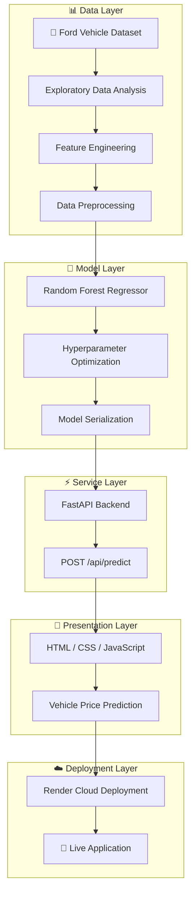

<div align="center">

  

  <br>

  <p>
    <a href="https://ford-price-intelligence-1.onrender.com">
      
    </a>
    
    
    
    
    
  </p>
 
  <p>
    <strong>Production-oriented vehicle price prediction powered by machine learning, FastAPI, and a custom web interface.</strong>
  </p>

</div>

---

## 📑 Table of Contents

* [Overview](#-overview)
* [Live Demo](#-live-demo)
* [Key Features](#-key-features)
* [Architecture](#-architecture)
* [Tech Stack](#-tech-stack)
* [Project Structure](#-project-structure)
* [Getting Started](#-getting-started)
* [API Reference](#-api-reference)
* [Deployment](#-deployment)
* [Engineering Notes](#-engineering-notes)
* [License](#-license)
* [Connect](#-connect)

---

## 🔮 Overview

**Ford Price Intelligence** is an end-to-end machine learning application designed to estimate Ford vehicle market prices from structured automotive data.

The system takes vehicle attributes through a web interface, processes the request through a trained regression model, and returns a real-time predicted valuation through a **FastAPI REST API**.

The complete workflow covers:

**Raw Data → EDA → Feature Engineering → Preprocessing → Model Training → Hyperparameter Optimization → Model Serialization → FastAPI → Web UI → Cloud Deployment**

The trained model is serialized using `joblib` and integrated directly into the application for inference.

> **No static placeholders or mock predictions.**
> Predictions are generated dynamically from user-provided vehicle attributes.

---

## 🚀 Live Demo

### [Ford Price Intelligence](https://ford-price-intelligence-1.onrender.com)

Test the deployed application directly in your browser.

You can enter vehicle information and receive a machine-learning-based price prediction through the deployed FastAPI application.

> **Note:** The application is hosted on Render. If the service has been idle, the first request may take some time because of the platform's cold-start behavior.

---

## ✨ Key Features

| Feature                     | Description                                                            |
| --------------------------- | ---------------------------------------------------------------------- |
| 🔮 **ML Predictions**       | Generates real-time Ford vehicle price estimates                       |
| 🌲 **Random Forest**        | Ensemble regression approach for nonlinear vehicle-price relationships |
| ⚡ **FastAPI Backend**       | Lightweight, high-performance REST API                                 |
| 🛡️ **Pydantic Validation** | Structured and validated prediction requests                           |
| 🎨 **Custom UI**            | Dark-themed responsive frontend with custom CSS                        |
| 📊 **Data Pipeline**        | EDA, preprocessing and feature engineering workflow                    |
| 💾 **Model Serialization**  | Trained model stored using Joblib                                      |
| 🐳 **Render Ready**         | Structured for container-based deployment                              |
| ☁️ **Cloud Deployment**     | Deployed application accessible through Render                         |

---

## 🏗️ Architecture

The application follows a layered machine learning architecture that transforms raw automotive data into real-time vehicle price intelligence.



### Pipeline Flow

```text
Ford Dataset
     │
     ▼
Exploratory Data Analysis
     │
     ▼
Feature Engineering
     │
     ▼
Data Preprocessing
     │
     ▼
Random Forest Regressor
     │
     ▼
Hyperparameter Optimization
     │
     ▼
Joblib Model Artifact
     │
     ▼
FastAPI REST API
     │
     ▼
Custom Web Interface
     │
     ▼
Real-Time Price Prediction
```

---

## 🧰 Tech Stack

| Layer                   | Technology                             |
| ----------------------- | -------------------------------------- |
| **Language**            | Python 3.11+                           |
| **Backend**             | FastAPI                                |
| **Validation**          | Pydantic v2                            |
| **Server**              | Uvicorn                                |
| **Machine Learning**    | scikit-learn                           |
| **Data Processing**     | pandas, NumPy                          |
| **Model Serialization** | Joblib                                 |
| **Frontend**            | HTML5, CSS3, JavaScript                |
| **Testing**             | pytest, HTTPX                          |
| **Version Control**     | Git                                    |
| **Containerization**    | Render                                 |
| **Deployment**          | Render                                 |
| **Typography**          | Fraunces, IBM Plex Sans, IBM Plex Mono |

### Core Stack

<p align="center">


</p>

---

## 📁 Project Structure

```text
ford-price-intelligence/
│
├── main.py
│   └── FastAPI application entrypoint,
│       API routes and static file serving
│
├── requirements.txt
│   └── Python dependencies
│
├── runtime.txt
│   └── Python runtime specification
│
├── .python-version3
│   └── Python version configuration
│
├── ford_price_predictor.pkl
│   └── Serialized trained ML model
│
├── index.html
│   └── Frontend interface
│
├── style.css
│   └── Custom dark-themed styling
│
└── script.js
    └── Frontend interaction and API communication
```

---

## ⚙️ Getting Started

### 1. Clone the repository

```bash
git clone https://github.com/AbhishekGrover1/ford-price-intelligence.git
cd ford-price-intelligence
```

### 2. Create a virtual environment

**macOS / Linux**

```bash
python3 -m venv venv
source venv/bin/activate
```

**Windows**

```bash
python -m venv venv
venv\Scripts\activate
```

### 3. Install dependencies

```bash
pip install -r requirements.txt
```

### 4. Start the FastAPI server

```bash
uvicorn main:app --reload
```

### 5. Open the application

```text
http://localhost:8000
```

---

## 🔌 API Reference

### `GET /`

Serves the frontend application.

**Response**

```text
HTML application interface
```

---

### `POST /api/predict`

Accepts vehicle attributes and returns a predicted Ford vehicle price.

**Request**

```http
POST /api/predict
Content-Type: application/json
```

**Example Response**

```json
{
  "predicted_price": 18500
}
```

> The exact request fields depend on the features implemented in the trained prediction pipeline.

---

## ☁️ Deployment

The application is structured for cloud deployment using:

```text
Application
     │
     ▼
FastAPI
     │
     ▼
Uvicorn
     │
     ▼
Render / Runtime Configuration
     │
     ▼
Render
     │
     ▼
Live Web Application
```

### Production Entry Point

```bash
uvicorn main:app --host 0.0.0.0 --port $PORT
```

---

## 🧠 Engineering Notes

### Machine Learning

The prediction system uses a **Random Forest regression approach**, allowing the model to capture nonlinear relationships between vehicle attributes and market price.

### Model Persistence

The trained model is serialized using:

```python
joblib
```

This allows the production application to load the trained artifact without retraining the model for every request.

### API Design

FastAPI provides:

* Typed request handling
* Pydantic validation
* RESTful prediction endpoint
* Automatic API documentation
* Lightweight asynchronous server architecture

### Frontend

The frontend intentionally avoids heavy JavaScript frameworks.

It uses:

```text
HTML5
CSS3
Vanilla JavaScript
```

This keeps the interface lightweight while maintaining direct communication with the prediction API.

---

## 🎯 Project Focus

This project demonstrates practical implementation of:

* Machine Learning regression
* Feature engineering
* Data preprocessing
* Model optimization
* Model serialization
* REST API development
* Frontend ↔ ML integration
* Production-style inference
* Cloud deployment

**From dataset to deployed prediction system.**

---

## 📜 License

This project is licensed under the **MIT License**.

---

## 🤝 Connect

<div align="center">

### Abhishek Grover

**AI/ML Engineer**

Building practical systems around **Machine Learning · LLMs · RAG · AI Agents · MLOps**

<br>

<a href="https://github.com/AbhishekGrover1">
  
</a>

<a href="https://www.linkedin.com/in/abhishek-grover07/">
  
</a>

<a href="https://abhishekgroverai.netlify.app/">
  
</a>

</div>

---

<div align="center">

**🚗 Ford Price Intelligence**

*Designed • Engineered • Deployed by Abhishek Grover*

</div>
